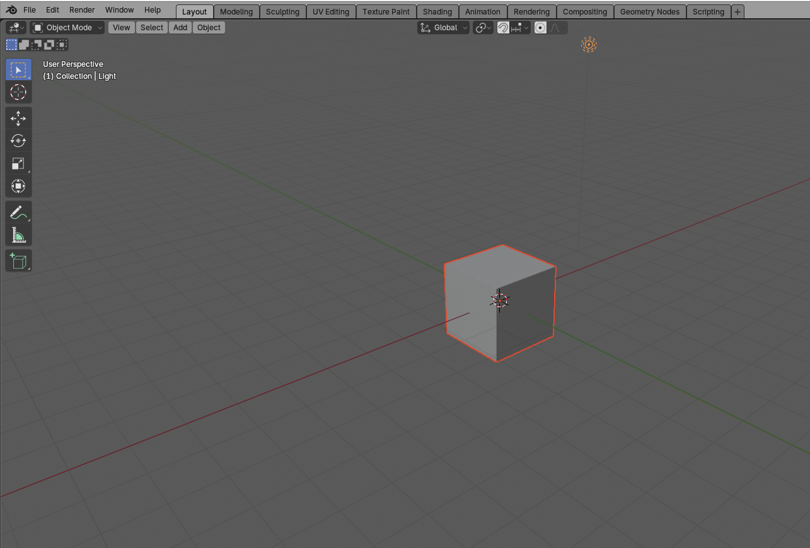
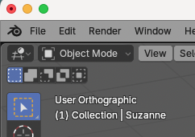

### Installation
Download Blender from https://www.blender.org/download/

### Change size of view port
Edit -> Preference -> Interface -> Resolution scale
Update it to 0.7

### View object from all angle

Click and hold scroll button + move mouse

### Zoom view port

1. Use mouse scroll button for zoom in and out.
2. Ctrl + hold mouse scroll wheel + move mouse in opposite direction for zoom in and out. Not recommended for mouse with screen wheel 

### Add new Cube

layout -> Add -> mesh -> Cube

### Change view orientation

Use number at Number pad
1 - Font view
7 - Top view
3 - Side view
9 - Back side of current view

5 -  switch between graphic mode/ Perspective mode

~  Tilde key (~) and choose option to view 
- Top
- Bottom
- Left
- Right
- Camera view
- Front
- Back
- View selected

### Object Mode

 
 
On Object mode you can **move** and **scale**, but cannot edit object

#### Scale object
1. Select the object
2. Press "S" key and scale it by moving mouse.
3. Right click to reset resizing.
4. Left click to stop scaling.
5. Press "S" key + 2 - To scale double the current size