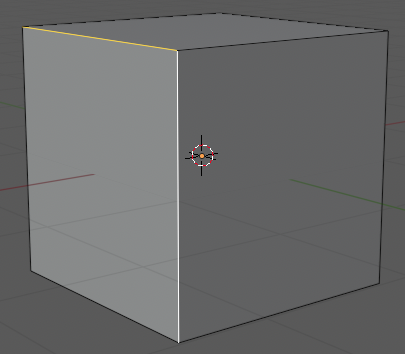

### Installation
Download Blender from https://www.blender.org/download/

### Change size of view port
Edit -> Preference -> Interface -> Resolution scale
Update it to 0.7

### View object from all angle

Click and hold scroll button + move mouse

### Zoom view port

1. Use mouse scroll button for zoom in and out.
2. Ctrl + hold mouse scroll wheel + move mouse in opposite direction for zoom in and out. Not recommended for mouse with screen wheel 

### Add new Cube

layout -> Add -> mesh -> Cube

### Change view orientation

Use number at Number pad

1 - Font view

7 - Top view

3 - Side view

9 - Back side of current view

5 - switch between graphic mode/ Perspective mode
 
4, 6, 8 and 2: To change object orientation towards Left, Right, Up and bottom

~  Tilde key (~) and choose option to view 
- Top
- Bottom
- Left
- Right
- Camera view
- Front
- Back
- View selected

### Object Mode

 
 
On Object mode you can **move** and **scale**, but cannot edit object

### Scale object
1. Select the object
2. Press "S" key and scale it by moving mouse.
3. Right click to reset resizing.
4. Left click to stop scaling.
5. Press "S" key + 2 - To scale double the current size

Press S + Z to scale the object vertically (height).

Press S + X to scale the object along the width.

Press S + Y to scale along the depth. ( To add thickness of wall ). 
It stretches or squashes toward and away from the screen (depending on your view).

### Move object

Press "G" and move mouse

Press "G" and "X/Y/Z' to move only in X, Y or Z axis

G + X + 3 - to move 3 steps

### Shading Pie Menu

Press "Z" and select an option

- **Wireframe** – Displays only the edges of the object.
- **Solid** – The default shading mode; shows solid geometry with basic lighting.
- **Material Preview** (formerly LookDev) – Shows materials with lighting and shading, good for previewing textures and materials.
- **Rendered** – Shows the final rendered view using the selected render engine (e.g., Eevee or Cycles).

### Edit mode

#### Select Vertex

Press 1 for vertex selection
Press Shift + click on vertex

### Select Edges

Press 2 for Edge selection
Press Shift + click on edges
